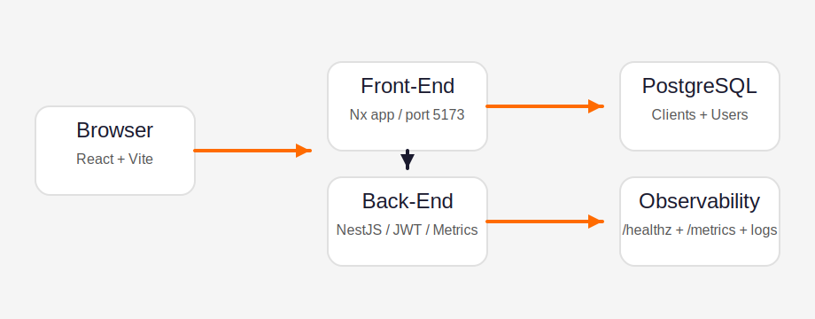
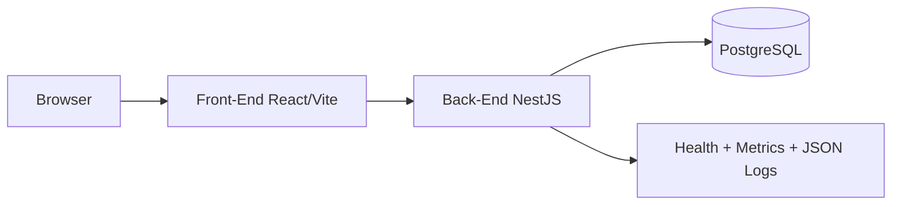
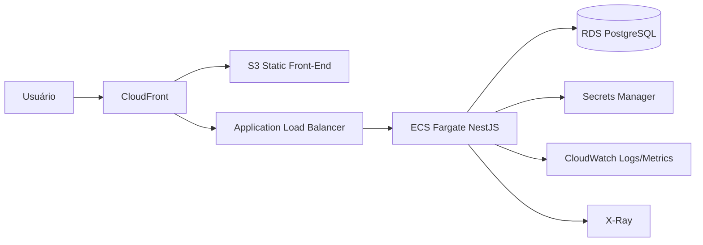

# Teddy Open Finance

MVP full-stack de gestão de clientes entregue como monorepo Nx, com um front-end React/Vite/TypeScript e um back-end NestJS/TypeORM/PostgreSQL. O foco é autenticação JWT, CRUD com soft delete, dashboard administrativo, trilha básica de auditoria e observabilidade mínima.



## Estrutura

```text
/
  README.md
  docker-compose.yml
  /docs
    architecture.svg
  /front-end
  /back-end
```

## Como rodar o stack completo

1. Revise [`teddy-open-finance/back-end/.env.example`](teddy-open-finance/back-end/.env.example) e [`teddy-open-finance/front-end/.env.example`](teddy-open-finance/front-end/.env.example).
2. Na raiz, execute `docker compose up --build`.
3. Acesse:
   - Front-end: `http://localhost:5173`
   - API: `http://localhost:3000`
   - Swagger: `http://localhost:3000/docs`
   - Health: `http://localhost:3000/healthz`
   - Metrics: `http://localhost:3000/metrics`

Usuário seed padrão:

- `admin@teddy.com`
- `teddy@2025`

## Arquitetura

### Local

- O navegador consome o front-end servido em `5173`.
- O front chama a API NestJS em `3000` com JWT Bearer.
- O back-end persiste em PostgreSQL e expõe `/healthz` e `/metrics`.
- Logs são emitidos em JSON para facilitar ingestão em observabilidade.

### Diagrama lógico



### AWS ilustrativo



## Decisões de escalabilidade

- Monorepo Nx com cache para evitar rebuilds e retestes desnecessários em CI.
- Front-end e back-end têm `docker-compose.yml` isolados para deploy independente.
- `GET /clients` usa paginação `page` + `pageSize`, reduzindo payload em listagens grandes.
- Dashboard usa endpoint dedicado `/dashboard/summary`, evitando múltiplas chamadas agregadas no cliente.
- `accessCount` é incrementado por operação atômica em transação, reduzindo risco sob concorrência.
- Métricas Prometheus e logs JSON já deixam o MVP preparado para scraping, alertas e troubleshooting.

## Observabilidade

- Logs estruturados em JSON com `level`, `message`, `timestamp` e `context`.
- `/healthz` verifica uptime e conectividade com o banco.
- `/metrics` expõe métricas HTTP, gauge de clientes ativos e contador de visualizações de detalhe.

Essas práticas importam porque tornam o comportamento do sistema legível em produção: latência, erros, indisponibilidade de banco e crescimento de uso deixam de ser invisíveis.

## CI/CD

- [`.github/workflows/frontend.yml`](.github/workflows/frontend.yml): lint, testes e build do front-end.
- [`.github/workflows/backend.yml`](.github/workflows/backend.yml): lint, testes e build do back-end.

## Observações

- O back-end está com `synchronize: true` para simplificar o bootstrap local do MVP. Em produção, o caminho correto é migrar para migrations versionadas.
- Redis ficou opcional e não foi incluído na composição inicial.
- O fluxo de registro foi adicionado no back-end, embora o front-end do MVP esteja centrado no login seedado.
